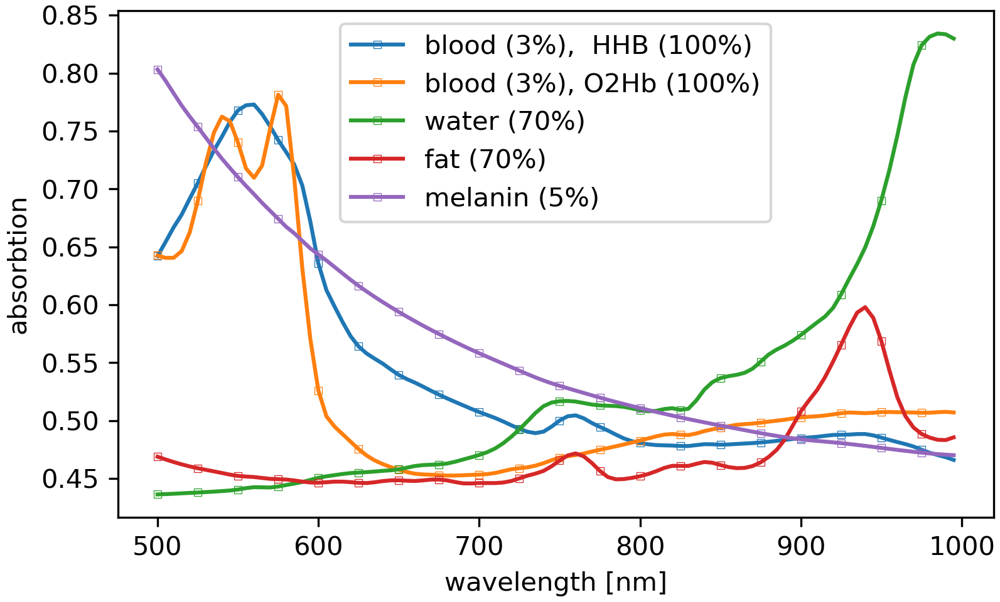

.. _analysis_hs_component_analysis:

Least square approximation using a set of base spectra
======================================================

This methods aims to represent a given spectrum :math:`\mathbf{b}` by a
weighted sum of base spectra :math:`\mathbf{v}_i` where :math:`i=1, \dots, n`.
The vector of optimal weights :math:`\mathbf{x}_\mathrm{opt}` which reflects
the individual contribution of each basis spectrum to :math:`\mathbf{b}` is
given by the linear least square problem

.. math::
    :label: lsProblem

    \mathbf{x_\mathrm{opt}} =
    \text{arg}\,\min\limits_{\hspace{-2em}\mathbf{x}}
        \left| \mathbf{A} \mathbf{x} - \mathbf{b} \right|^2,

with the system matrix

.. math::
    :label: lsSystemMatrix

    \mathbf{A} = \begin{pmatrix}
        \mathbf{v_1} & \mathbf{v_2} & \dots & \mathbf{v_n}
    \end{pmatrix}.

The base spectra are derived from Monte Carlo simulations of photons incident
on a predefined scattering medium. The following figure shows the statistically
averaged absorbtion of light as a function of wavelength for different
homogeneous tissues.

The spectrum :math:`\mathbf{b}` to be approximated is generally compromised by
background light. This can be accounted in the least square problem
:eq:`lsProblem` by an offset correction using a base vector :math:`\mathbf{v}_n`
whose elements are chosen to unity. Thus, the corresponding wheight :math:`x_n`
is the offset itself.
Note, the offset correction is automatically involved in
:class:`hsi.analysis.HSImageLSAnalysis` and must not be implemented by a
separate base vector.

Example
-------

Code snipped for least square fit analysis ::

    from hsi.analysis import HSImageLSAnalysis

    # spec - spectrum to be fitted
    # vi - i-th base vector
    # wavelen - points at 'spec' is sampled

    model = HSImageLSAnalysis(wavelen, spec)
    model.addBaseVector(v1, name="HHb", weight=0.03, bounds=[0, 0.05])
    model.addBaseVector(v2, name="O2Hb", weight=0.03, bounds=[0, 0.05])
    ...
    model.addBaseVector(v5, name="Melanin", weight=0.05, bounds=[0, 0.1])

    model.fit(method='bvls')

Ordinary least squares formulation
----------------------------------

The ordinary least squares formulation is used for the unconstrained case. The
solution vector :math:`\mathbf{x}_\mathrm{opt}` results from the projected
problem

.. math::
    :label: lsLinProj

    \mathbf{A}^{\mathsf{T}}\mathbf{A}\mathbf{x} =
    \mathbf{A}^{\mathsf{T}} \mathbf{b},

using the Moore–Penrose inverse according to

.. math::
    :label: lsLinSol

    \mathbf{x}_\mathrm{opt} =
    \left( \mathbf{A}^{\mathsf{T}}\mathbf{A} \right)^{-1}
    \mathbf{A}^{\mathsf{T}} \mathbf{b}.

The solution to this problem is unique but due to the unconstrained character
permits unphysical weights for the base spectra, in particular negative values
are possible.

Two implementations for this approach are availabe. They are referred as 'gesv'

=============== =======================================================
**method**
gesv            based on numpy.linalg.solve
lstsq           based on numpy.linalg.lstsq

=============== =======================================================

Constrained least squares problem
---------------------------------

* Non-negative least squares (nnls)
* Bounded-Variable Least-Square (bvls, bvls_f)
* Trust region reflective algorithm (trf)

Non-linear minimization
-----------------------

* Sequential least squares Programming  (slsqp)
* Constrained BFGS algorithm (l-bfgs-b)
* Conjugate gradient algorithm (cg)

